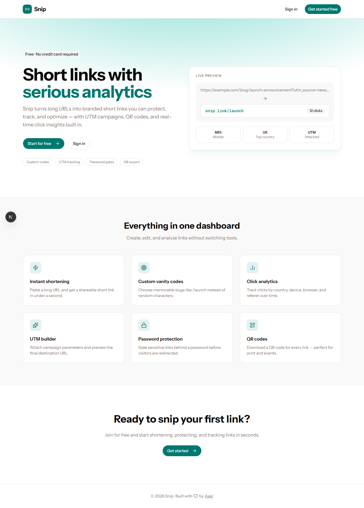

# Snip

A modern URL shortener with click analytics, custom vanity codes, UTM campaign builder, password-protected links, and QR code export.



## Features

- **Short links** — Instantly shorten long URLs with auto-generated or custom slugs
- **Click analytics** — Track clicks by country, device, browser, and referer
- **UTM builder** — Attach campaign parameters and preview the final destination URL
- **Password protection** — Gate sensitive links behind a password before redirect
- **QR codes** — Download a QR code for any short link
- **Link controls** — Enable, disable, or set expiry dates on links

## Tech stack

- [Next.js 16](https://nextjs.org/) (App Router)
- [Drizzle ORM](https://orm.drizzle.team/) + MySQL
- [Better Auth](https://www.better-auth.com/) for authentication
- [Tailwind CSS](https://tailwindcss.com/) + [shadcn/ui](https://ui.shadcn.com/)
- [Upstash Redis](https://upstash.com/) for rate limiting (optional)

## Getting started

### Prerequisites

- Node.js 20+
- pnpm
- MySQL database

### Setup

1. Clone the repository and install dependencies:

```bash
pnpm install
```

2. Copy environment variables and fill in your values:

```bash
cp .env.example .env.local
```

3. Push the database schema:

```bash
pnpm db:push
```

4. Start the development server:

```bash
pnpm dev
```

Open [http://localhost:3000](http://localhost:3000) to view the app.

## Scripts

| Command | Description |
|---------|-------------|
| `pnpm dev` | Start development server |
| `pnpm build` | Build for production |
| `pnpm start` | Start production server |
| `pnpm db:push` | Push Drizzle schema to database |
| `pnpm db:studio` | Open Drizzle Studio |

## License

Private project.
